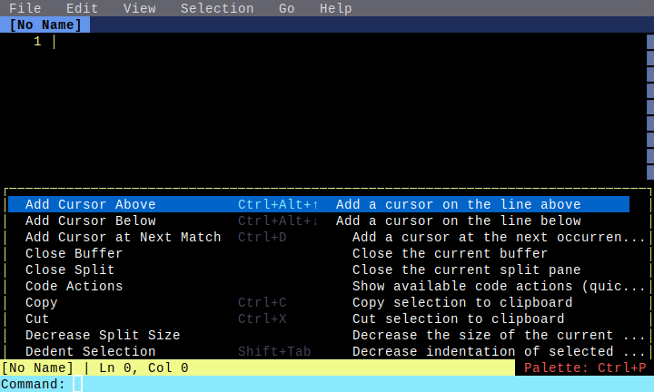

# Command Palette

**Category**: Core Features

*Using the command palette to execute commands*

---

## Step 1: initial

*Editor before opening command palette*

## Step 2: palette_open

*Command palette opened*

