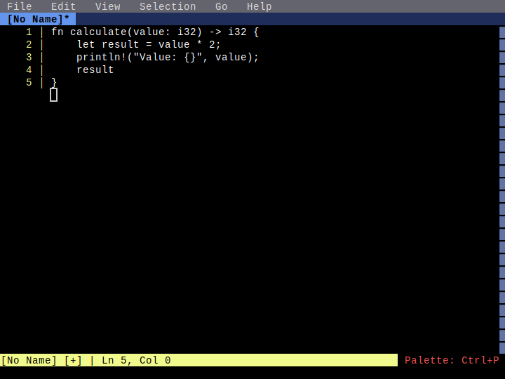

# LSP Rename

**Category**: LSP Features

*Renaming a symbol across multiple locations using F2*

---

## Step 1: initial_code

*Function with 'value' parameter used twice*

## Step 2: cursor_on_symbol

*Cursor positioned on 'value' parameter*

